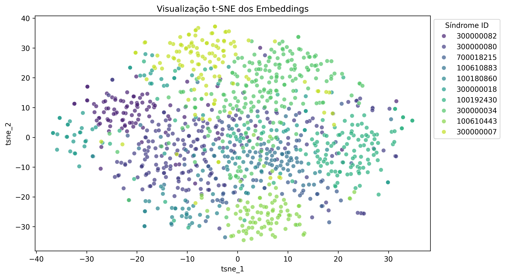

# Análise de Embeddings e Classificação de Síndromes Genéticas

O arquivo mini_gm_public_v0.1.p contém outputs(embeddings derivados de imagens) de um modelo pré-treinado de classificação de síndromes genéticas.

O objetivo deste estudo é realizar o pré-processamento dos dados, visualização e classificação, incluindo também métricas e insights.

## Estrutura do Dataset

Os embeddings do arquivo picle mini_gm_public_v0.1.p são vetores de 320 posições e seguem a seguinte estrutura:

{
    'syndrome_id': {
        'subject_id': {
            'image_id': [vetor de embeddings]
        }
    }
}

Estes vetores de embeddings serão usados para classificar as syndrome_id's.

## Para Análise e classificação, seguiremos algumas etapas:

1. Processamento dos dados:

    - A estrutura do arquivo mini_gm_public_v0.1.p não é ideal para trabalharmos a visualização dos dados e a implementação de modelos de classificação. Por isso, no arquivo src/data_prep.py, implementamos uma função que converte a estrutura em um DataFrame do Pandas, dividindo os dados por colunas no seguinte formato:

    | syndrome_id | subject_id | image_id | dim_0 | ... | dim_319 |

    - Os 320 valores do vetor de embeddings agora estão divididos em colunas (dim_0 a dim_319).

    - Algumas estatísticas iniciais dos dados:
        - Um total de 10 síndromes são representadas nos dados. Cada síndrome é representada por uma numeração. Abaixo temos a numeração de cada sindrome e a quantidade de amostras correspondentes no dataset.
            
            syndrome_id
            300000034    210
            300000080    198
            100192430    136
            300000007    115
            300000082     98
            100610443     89
            300000018     74
            100180860     67
            100610883     65
            700018215     64

        - A distribuição das amostras varia bastante, entre 64 a 210 amostras. Uma baixa quantidade de amostras para o treinamento pode resultar em um modelo não tão bom para generalizar as amostras de teste e não classificar tão bem para as síndromes de baixa amostragem.

2. Visualizaçao dos Dados:

    - Nossa visão se limita a 3 dimensões, ou seja, não temos capacidade de interpretar de forma gráfica um vetor de 320 posições. Mas para estes casos, podemos tentar simplificar os dados através de técnicas de redução de dimensionalidade, como PCA ou t-SNE (como usaremos aqui), e assim conseguir interpretar de forma visual a distribuição dos dados.

    - O t-SNE (t-distributed Stochastic Neighbor Embedding) [1] é um algoritmo que permite a visualização de dados multidimensionais. Os gráficos t-SNE modelam cada objeto de alta dimensionalidade em um ponto de duas ou três dimensões de mod que objetos semelhantes são modelados por pontos próximos [2].
    
    - O gráfico de dispersão a seguir mostra a modelagem t-SNE dos embeddings em duas dimensões.

    

# Referências Bibliográficas

[1] van der Maaten, L.J.P. t-Distributed Stochastic Neighbor Embedding
https://lvdmaaten.github.io/tsne/

[2] gráficos t-SNE
https://www.ibm.com/docs/pt-br/spss-modeler/18.5.0?topic=types-t-sne-charts

